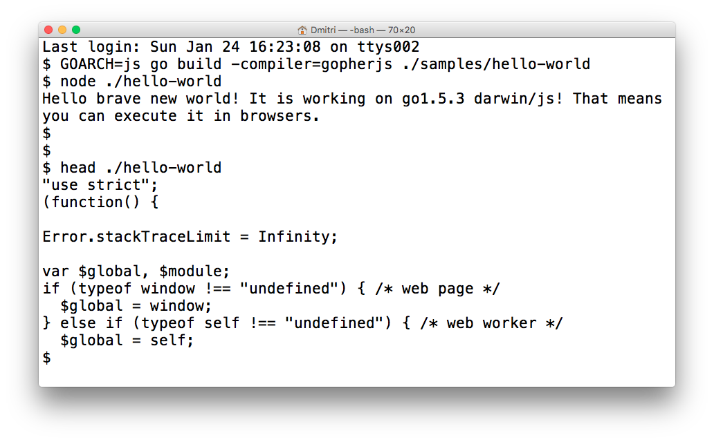

# cmd-go-js

cmd-go-js is a "feature branch" of cmd/go command with experimental changes. The goal was to explore adding support for additional Go compilers and environments by making use of existing -compiler and -exec flags:

> -compiler name - name of compiler to use, as in runtime.Compiler (gccgo or gc).
>
> -exec xprog - Run the test binary using xprog. The behavior is the same as in 'go run'. See 'go help run' for details.

Specifically, I wanted to try adding support for [GopherJS compiler](https://github.com/gopherjs/gopherjs) which targets `GOARCH=js` architecture. It compiles Go code to JavaScript which can be executed by a JavaScript engine (such as V8 JavaScript Engine, Node.js, or any browser with JavaScript support).

# Results



#### go build

You can now use `go` to build for `GOARCH=js` architecture! That is the only architecture that all browsers can execute natively, without any plugins.

```bash
# Normal build for GOARCH=amd64.
$ go build ./samples/hello-world
# Note that above implicitly means:
# GOARCH=amd64 go build -compiler=gc ./samples/hello-world
$ ./hello-world
Hello brave new world! It is working on go1.5.3 darwin/amd64!

# Newly supported build for GOARCH=js.
$ GOARCH=js go build -compiler=gopherjs ./samples/hello-world
$ node ./hello-world
Hello brave new world! It is working on go1.5.3 darwin/js! That means you can execute it in browsers.
```

#### go run

`go run` also works. You can use the `-exec` flag to have `node` execute the compiled JavaScript output.

```bash
$ go run ./samples/hello-world/main.go
Hello brave new world! It is working on go1.5.3 darwin/amd64!

$ GOARCH=js go run -compiler=gopherjs -exec=node ./samples/hello-world/main.go
Hello brave new world! It is working on go1.5.3 darwin/js! That means you can execute it in browsers.
```

From https://golang.org/cmd/go/#hdr-Compile_and_run_Go_program:

> If the -exec flag is not given, GOOS or GOARCH is different from the system default, and a program named go_$GOOS_$GOARCH_exec can be found on the current search path, 'go run' invokes the binary using that program, for example 'go_nacl_386_exec a.out arguments...'. This allows execution of cross-compiled programs when a simulator or other execution method is available.

That means if you create a symlink to `node` binary named `go_darwin_js_exec`, then you can just:

```bash
$ GOARCH=js go run -compiler=gopherjs ./samples/hello-world/main.go
Hello brave new world! It is working on go1.5.3 darwin/js! That means you can execute it in browsers.
```

# Implementation details, lessons learned, other notes

### go test

`go test` can be made to support `-compiler=gopherjs` with `-exec=node`, but additional work needs to be done; it currently doesn't work.

```bash
$ GOARCH=js go test -v -compiler=gopherjs -exec=node ./samples/hello-world
=== RUN   TestBasic
--- PASS: TestBasic (0.00s)
PASS
ok  	github.com/gophergala2016/cmd-go-js/samples/hello-world	0.015s
```

That means all of go support for [testing](https://godoc.org/testing) would be availble. Including tests, executable examples, and benchmarks.

### Toolchains

`cmd/go` defines a very clean `toolchain` interface internally:

```Go
type toolchain interface {
	// gc runs the compiler in a specific directory on a set of files
	// and returns the name of the generated output file.
	// The compiler runs in the directory dir.
	gc(b *builder, p *Package, archive, obj string, asmhdr bool, importArgs []string, gofiles []string) (ofile string, out []byte, err error)
	// cc runs the toolchain's C compiler in a directory on a C file
	// to produce an output file.
	cc(b *builder, p *Package, objdir, ofile, cfile string) error
	// asm runs the assembler in a specific directory on a specific file
	// to generate the named output file.
	asm(b *builder, p *Package, obj, ofile, sfile string) error
	// pkgpath builds an appropriate path for a temporary package file.
	pkgpath(basedir string, p *Package) string
	// pack runs the archive packer in a specific directory to create
	// an archive from a set of object files.
	// typically it is run in the object directory.
	pack(b *builder, p *Package, objDir, afile string, ofiles []string) error
	// ld runs the linker to create an executable starting at mainpkg.
	ld(b *builder, root *action, out string, allactions []*action, mainpkg string, ofiles []string) error
	// ldShared runs the linker to create a shared library containing the pkgs built by toplevelactions
	ldShared(b *builder, toplevelactions []*action, out string, allactions []*action) error

	compiler() string
	linker() string
}
```

It currently has two main implementations `gcToolchain`, and `gccgoToolchain` (there's also a 3rd, `noToolchain`, that does nothing). Here you can see how Go currently supports only two values for -compiler flag.

```Go
switch value {
case "gc":
	buildToolchain = gcToolchain{}
case "gccgo":
	buildToolchain = gccgoToolchain{}
default:
	return fmt.Errorf("unknown compiler %q", value)
}
```

It's possible to either add GopherJS specifically:

```Go
switch value {
case "gc":
	buildToolchain = gcToolchain{}
case "gccgo":
	buildToolchain = gccgoToolchain{}
case "gopherjs":
	buildToolchain = gopherjsToolchain{}
default:
	return fmt.Errorf("unknown compiler %q", value)
}
```

Or create a general toolchain that can accept any arbitrary -compiler flag value:

```Go
switch value {
case "gc":
	buildToolchain = gcToolchain{}
case "gccgo":
	buildToolchain = gccgoToolchain{}
default:
	switch compilerBin, err := exec.LookPath(value); err {
	case nil:
		buildToolchain = generalToolchain{compilerBin: compilerBin}
	default:
		return fmt.Errorf("unknown compiler %q", value)
	}
}
```

### Go 1.6 vs 1.5

The code for `cmd/go` has a large volume of changes from 1.5 to tip.

I've chosen to work with Go 1.5 for now, since GopherJS compiler only supports Go 1.5 at this time. There is an issue at [gopherjs/gopherjs#355](https://github.com/gopherjs/gopherjs/issues/355) tracking progress for adding Go 1.6 support, and @neelance says it's close.

I initially tried Go 1.6 (see [`go1.6` branch](https://github.com/gophergala2016/cmd-go-js/commits/go1.6)), but switched to working with Go 1.5 at this time for the above reasons.

### Code changes

The first five commits of [`master` branch](https://github.com/gophergala2016/cmd-go-js/commits/master) simply check in the original `cmd/go` binary source at commit [`go1.5.3`](https://github.com/golang/go/tree/go1.5.3), and make minimal changes to allow it to build on OS X and be go-gettable. It also vendors `go/build` package from standard library, in order to be able to make changes to it.

The rest of the changes are the relevant changes to add `-compiler=gopherjs` support to be able to build for `GOARCH=js` architecture. These changes are relatively minimal (a couple hundred lines) and not disruptive. The diff can be seen here:

https://github.com/gophergala2016/cmd-go-js/compare/c900f90...master

### Installation

**Note:** Due to time limits, this project works on OS X only. Adding support for other other systems is easy, but it hasn't been done yet. See commit message of [`2dae5232`](https://github.com/gophergala2016/cmd-go-js/commit/2dae52322dcef1b91b9b363fa2301da735188370), that is the only blocker.

Go 1.5 is required.

```bash
go get -u github.com/gopherjs/gopherjs
GO15VENDOREXPERIMENT=1 go get -u github.com/gophergala2016/cmd-go-js/cmd/go
```

Since the binary is also called `go`, make sure you run the right one.

```bash
$ $GOPATH/bin/go version
go version go1.5.3 darwin/amd64 (with experimental changes)
```

You may need Node if you want to execute generated JavaScript from the command line rather than inside a browser.

```bash
brew install node
```
